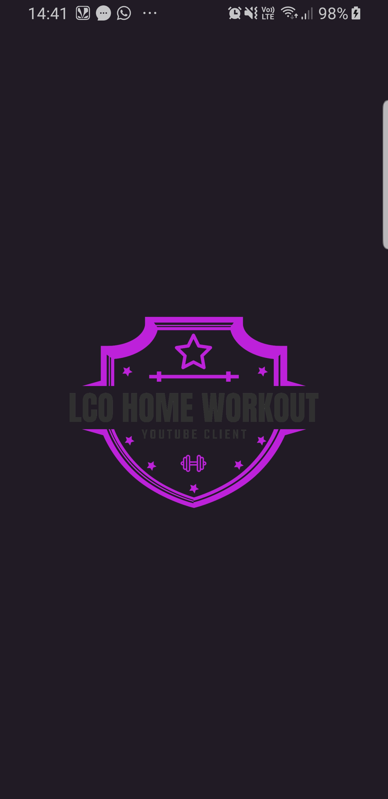
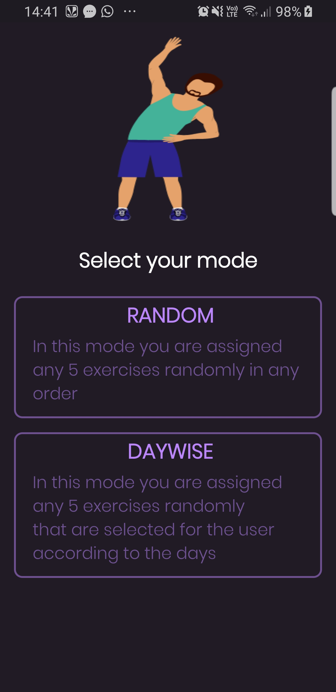
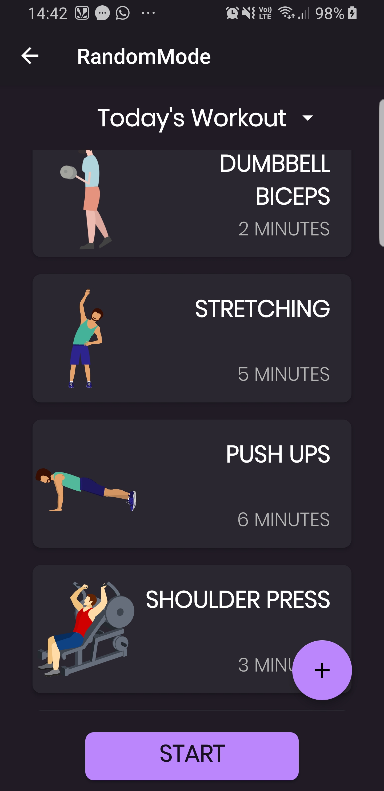
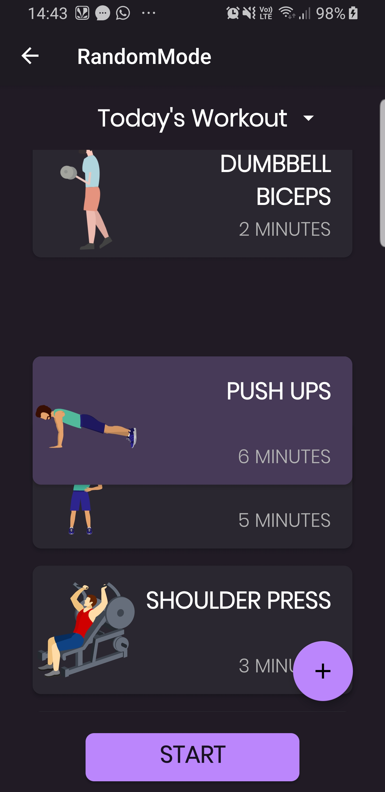
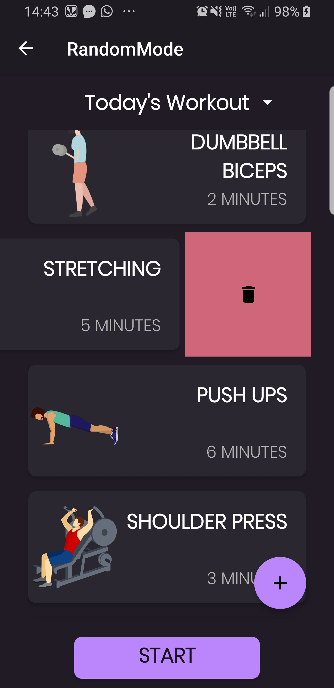
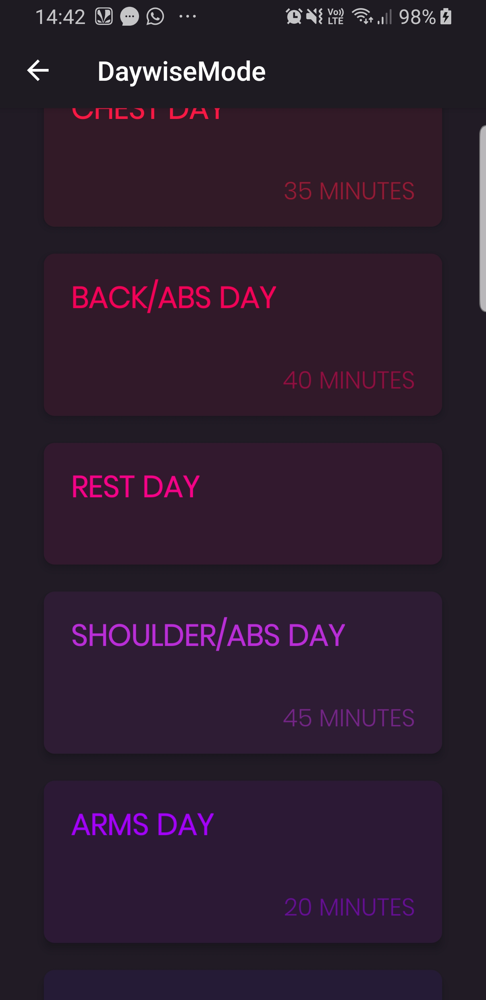

# Workout-Application

A basic workout application with two modes i.e Random mode and Daywise mode.In random mode 5 random exercise are selected for the user by the application and user can add delete or rearrange an exercise in daywise mode exercises are recommended considering the day.As long as the exercise is going on song is played and after each exercise there is a break of 40 seconds.Tried developing a user friendly app with
<b>dark theme</b> used <b>custom card view</b> and added <b>draggable and swipe to delete feature</b> also used <b>recycler view</b> for the same

## Snapshots

### Splash screen

### Main screen

### Random mode
    

#### 2nd image displays the draggable to change position feature whereas the 3rd image displays swipe to delete feature

### Daywise mode
 

#### After clicking on screen(1st image) this screen appears(2nd image)
